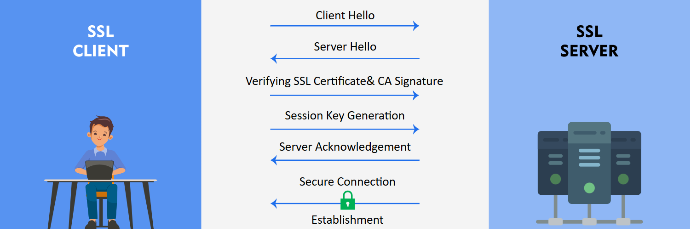

# 🔐 Secure SSL/TLS Encrypted C++ Client-Server Communication 
## (Explanation for the folder 'secure-cpp-server')
This project demonstrates how to implement **SSL/TLS encrypted communication** between a **C++ server and client** using **OpenSSL**. It features a multithreaded server that handles multiple secure client connections.

---

## 📁 Project Structure

```
secure-cpp-server/
├── client_ssl.cpp                  # Client-side SSL code
├── server_ssl_multithreaded.cpp # Multithreaded server with SSL
├── certs/                      # Folder to store SSL certificate and key
│   ├── server.crt              # Self-signed certificate (Will be generated)
│   └── server.key              # Server private key  (Will be generated)
└── README.md                   # Project documentation
```

---

## 🚀 Step-by-Step Guide

### ✅ Step 1: Project Setup

Create your project folder and prepare SSL certificates.

```bash
mkdir secure-cpp-server
cd secure-cpp-server

# Create a folder for certificates
mkdir certs
cd certs

# 1. Generate Private Key
openssl genrsa -out server.key 2048

# 2. Generate Self-Signed Certificate
openssl req -new -x509 -key server.key -out server.crt -days 365

# Go back to root folder
cd ..
```

📌 You should now have:

```
secure-cpp-server/certs/server.key
secure-cpp-server/certs/server.crt
```

---

### 💾 Step 2: Add Your Code

Save your source code files:

* `server_ssl_multithreaded.cpp` – Secure multithreaded server
* `client_ssl.cpp` – Secure client

---

### 🛠️ Step 3: Compile

Ensure OpenSSL is installed on your system.

```bash
# Compile the server
g++ server_ssl_multithreaded.cpp -o server -lssl -lcrypto -lpthread

# Compile the client
g++ client.cpp -o client -lssl -lcrypto
```

---

### ▶️ Step 4: Run the Application

Start the server and client:

```bash
# Run server
./server
# Output: Server listening on port 8080...

# Run client in another terminal
./client
```

📡 You can now enter commands securely:

```bash
ls
whoami
date
...etc (Look for all the commands possible in the documentation folders.)
exit  # to disconnect
```

---

## 🔒 How SSL/TLS Works in This Project

### Step-by-step SSL Handshake (Simplified):

1. 🔐 **Client Hello** – Client says hello and sends supported cipher suites.
2. 🔐 **Server Hello** – Server replies with its SSL certificate and selected cipher suite.
3. 🛂 **Certificate Verification** – Client checks if the server’s certificate is trusted.
4. 🔐 **Key Exchange** – A symmetric key is generated securely using asymmetric encryption.
5. 📶 **Secure Communication** – All data is now encrypted using the symmetric key.
   <br>
   

---

## 🧠 Key Concepts

### 📌 Asymmetric Encryption

* Uses a **public-private key pair**
* Public key is used to encrypt data, private key to decrypt
* Used during handshake to exchange the symmetric key securely

### 📌 Symmetric Encryption

* Uses a **single key** for both encryption and decryption
* Much **faster** than asymmetric
* Used for **actual data transfer** after the handshake

### 📌 Cipher Suite

* A set of algorithms used in SSL/TLS including:

  * Key exchange algorithm (e.g., RSA, DH)
  * Encryption algorithm (e.g., AES)
  * Message authentication code (e.g., SHA256)

---

## 📚 Technologies Used

* C++
* OpenSSL Library
* POSIX Threads (for multithreading on server)

---

## 📌 Requirements

* Linux/Unix-based OS (Ubuntu recommended)
* g++ compiler
* OpenSSL installed

---

## 🧪 Testing Commands

Once connected:

```bash
ls        # Lists server-side files
whoami    # Shows server process user
uname -a  # Shows system info
exit      # Terminates connection
```

---

## 🤝 Contribution

This is a learning-focused project. Contributions and improvements are welcome!

---

## 📜 License

This project is open source and free to use for educational purposes.

---

## 🌐 Author

Developed by **Arvind Kumar Yadav** – In the field of cybersecurity & secure networking learning. - In the Sasken Summer Internship 2025 (02 June 2025  -  25 July 2025)
